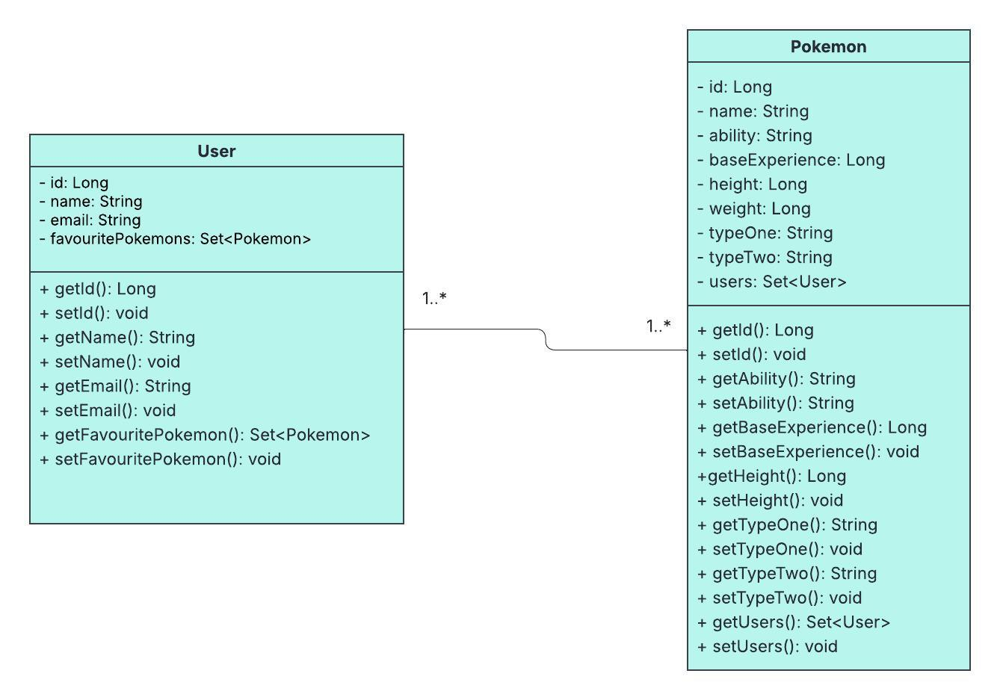

# Pokémon Collector
View over 150 beautifully illustrated Pokémon cards. Deal with the tricky decision of which 3 are your all-time favourites.
Select them and then view them again on the selection page.  

### Features

- Over 150 beautifully illustrated Pokémon.
- View cards containing images of the Pokémon and their attributes.
- Select your top 3 Pokémon and see them on the selection page.
- Login and logout functionality.
- Selected favourites retained for when you log in again.

### Technologies being used

- Spring boot backend
- React and SCSS frontend
- Hosted on Railway
- MySQL database for persistence

### UML Diagram

The User and Pokémon entities have a Many-to-many relationship, as displayed below.

### Live demo

https://pokemon-collector-frontend-production.up.railway.app/